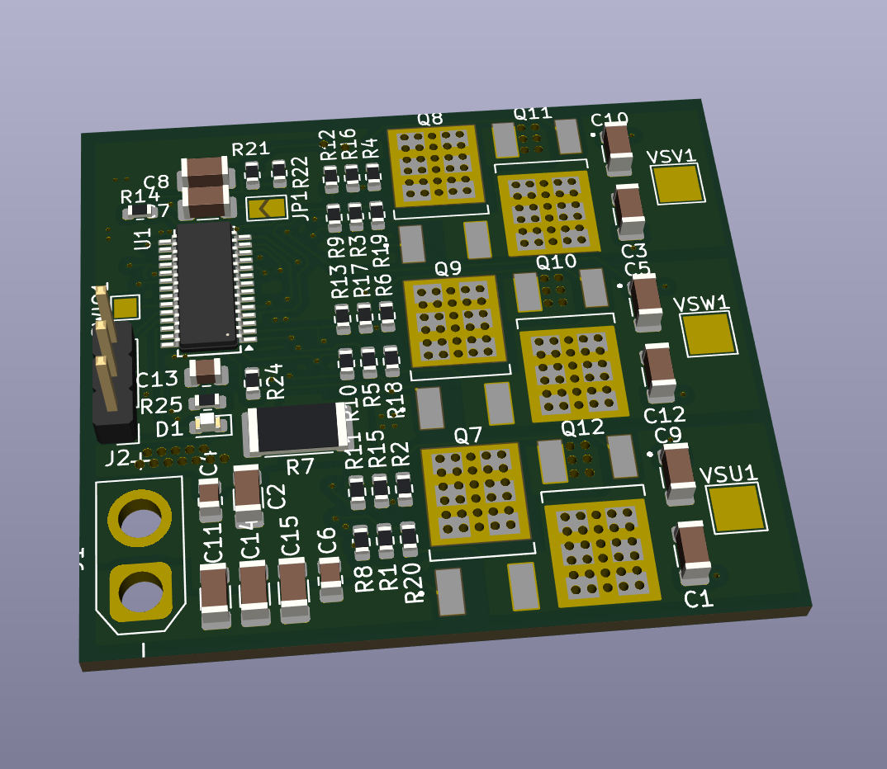
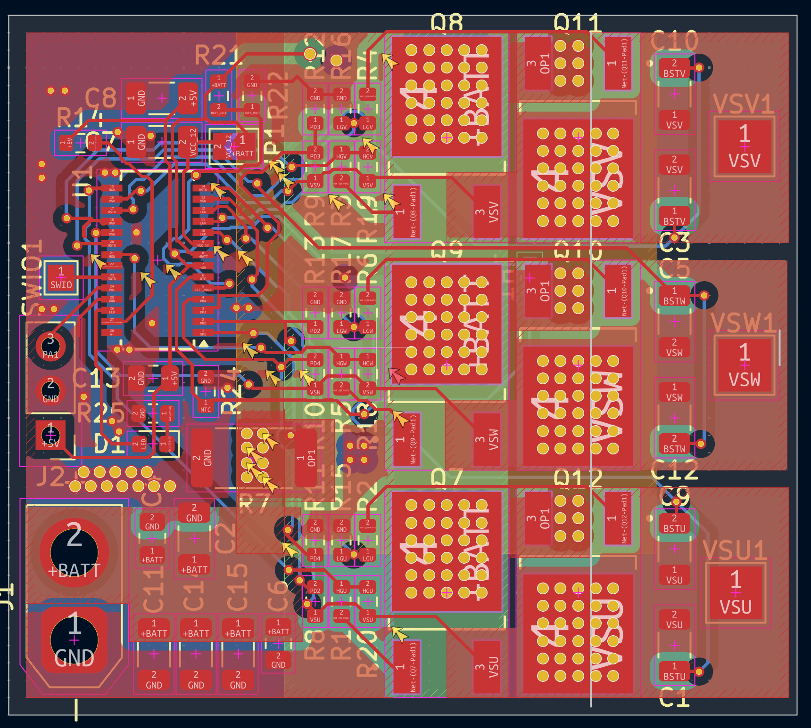
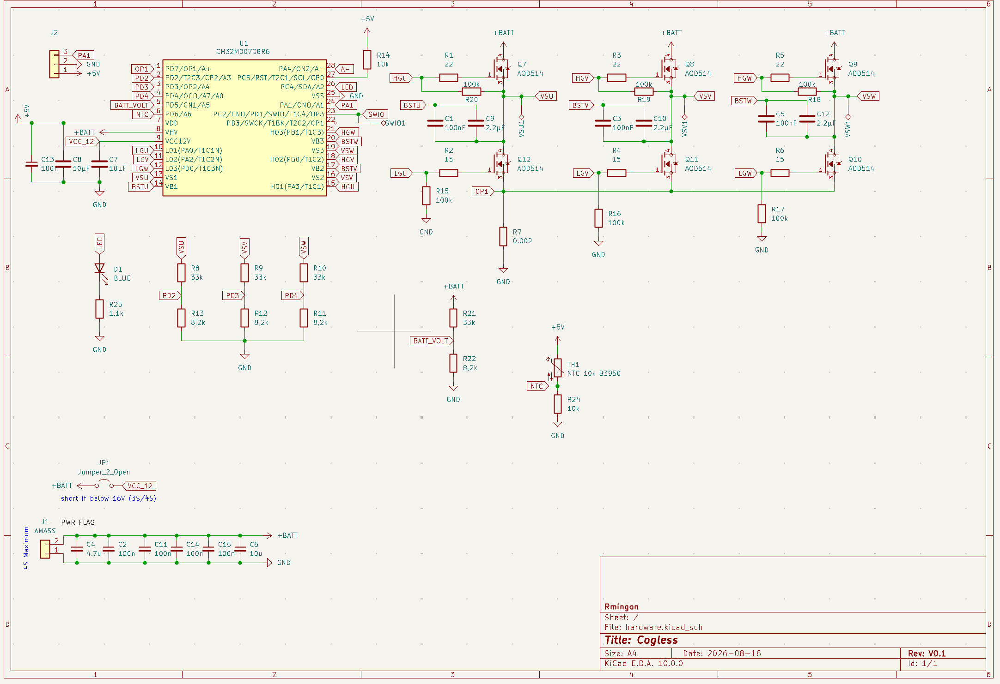

# Cogless

**A tiny, fully open-source FOC ESC built around a single chip.**

   

## Why Cogless?

Most hobby ESCs are black boxes: closed firmware, undocumented hardware, and a gate driver + MCU + op-amp combo spread across a dozen chips. **Cogless takes the opposite approach**: one modern motor-control SoC, a clean 4-layer board, and every design file public.

The secret is the **WCH CH32M007G8R6**, a RISC-V microcontroller that integrates on a single die everything an ESC brain needs:

- 3-phase N+N gate pre-driver (up to 48V) with built-in bootstrap diodes and dead-time control
- High-voltage LDO chain: battery in, 12V gate rail and 5V logic out, zero external regulators
- Programmable-gain current-sense amplifier (4/8/16/32×) wired for single-shunt FOC
- Comparators tied to the PWM timer's emergency brake for hardware overcurrent shutdown
- 12-bit 3Msps ADC, 48MHz QingKe RISC-V core

Result: a complete field-oriented-control power stage with **one IC, six MOSFETs and a handful of passives**, on a 45×40mm board.

## Hardware at a glance

| | |
|---|---|
| **MCU / driver** | WCH CH32M007G8R6 (RISC-V, 48MHz, integrated 48V 3-phase gate driver) |
| **Power stage** | 6× AOD514 (30V, 46A, 5.9mΩ) in DPAK with thermal via farms |
| **Battery** | 2S to 4S LiPo (max 16.8V), XT30 connector |
| **Current sensing** | 2mΩ 2512 shunt, Kelvin-routed differential sense, internal PGA |
| **Voltage sensing** | All 3 phase back-EMF dividers + battery voltage divider (8.2k/33k, scaled for 4S) |
| **Temperature** | 10k B3950 NTC placed against the low-side FETs, thermal derating ready |
| **Control input** | 3-pin header (5V / GND / signal): servo PWM, DShot, or analog/PWM magnetic encoder (AS5600, MT6701) |
| **Debug** | WCH 1-wire SDI (SWIO pad), works with WCH-LinkE |
| **Extras** | Status LED, solder jumper to bypass the HV regulator on ≤3S packs |
| **PCB** | 4 layers, 45×40mm, KiCad 10 |

## Design highlights

**Single-shunt FOC sensing done right.** The shunt is sensed differentially: both PGA inputs (A+ and A-) run as a Kelvin pair straight from the shunt pads, so gate-drive noise and power-trace voltage drops stay out of the current measurement.

**Sensorless-first, encoder-friendly.** The three phase dividers feed the ADC for back-EMF observers (or comparator-based zero-crossing), so no position sensor is required. Want absolute position or full torque at standstill? Plug an AS5600/MT6701 breakout into the same 3-pin header, its analog or PWM output lands on an ADC + input-capture capable pin.

**Every gate is held safe.** All six MOSFETs carry 100k gate pulldowns, high-side ones referenced to their own phase node, so the bridge stays off while the driver powers up.

**Scaled for 4S.** Divider ratios put a full 16.8V pack at 3.3V on the ADC, keeping the full converter resolution. Under-voltage cutoff, bus-voltage compensation and thermal derating are all measurable in hardware; the firmware just has to use them.

**One solder jumper, two power modes.** On ≤3S packs, close JP1 to short VHV to VCC12V and bypass the internal high-voltage regulator entirely (per datasheet guidance for sub-16V operation). Leave it open on 4S.

## Schematic

Full sources live in [`hardware/`](hardware/): KiCad 10 project, schematic and routed board.

## Status

- [x] Schematic complete, ERC clean (reviewed against the CH32M007 datasheet)
- [x] 4-layer PCB routed
- [ ] First prototype ordered and bring-up
- [ ] FOC firmware (based on WCH's CH32M007 EVT motor examples)
- [ ] DShot input + telemetry

## Flashing / debugging

The CH32M007 uses WCH's 1-wire SDI protocol. Connect a **WCH-LinkE** (a few euros) to the SWIO pad, GND and 5V, then flash with [wchisp](https://github.com/ch32-rs/wchisp), [wlink](https://github.com/ch32-rs/wlink) or MounRiver Studio. WCH's [CH32M007 EVT package](https://www.wch-ic.com/products/CH32M007.html) ships FOC and BLDC reference firmware that maps directly onto this board's pinout.

## Contributing

Issues and PRs are welcome: layout review, firmware ports, bring-up reports, or just photos of your build. If you spin a variant (higher voltage FETs, different connectors), open a discussion, the goal is a family of small, hackable ESCs.

## Disclaimer

This is a power-electronics project. LiPo batteries and motors can cause fire and injury. Build and test at your own risk, start with a current-limited supply, and never leave a first power-up unattended.

## License

- **Hardware** (everything under [`hardware/`](hardware/), schematics, PCB, fabrication outputs): [CERN-OHL-P v2](LICENSE-HARDWARE)
- **Firmware** (coming soon): [MIT](LICENSE-FIRMWARE)

You can use this design in commercial products; just keep the copyright and licence notices intact.
