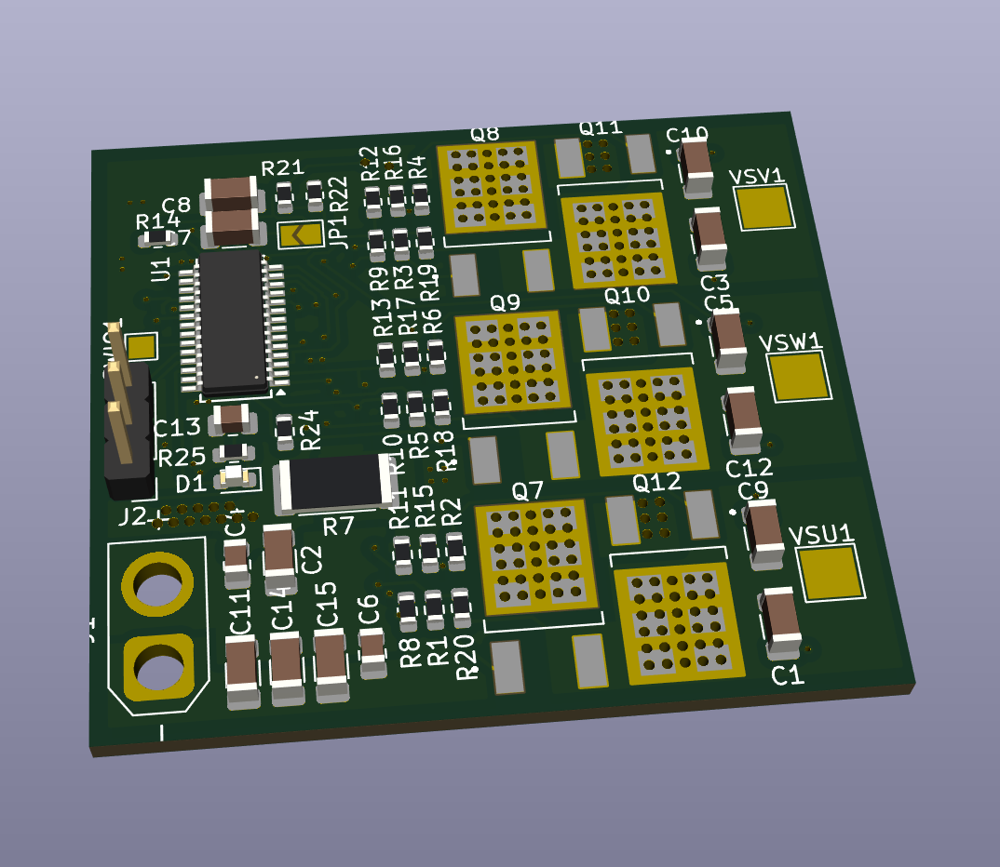
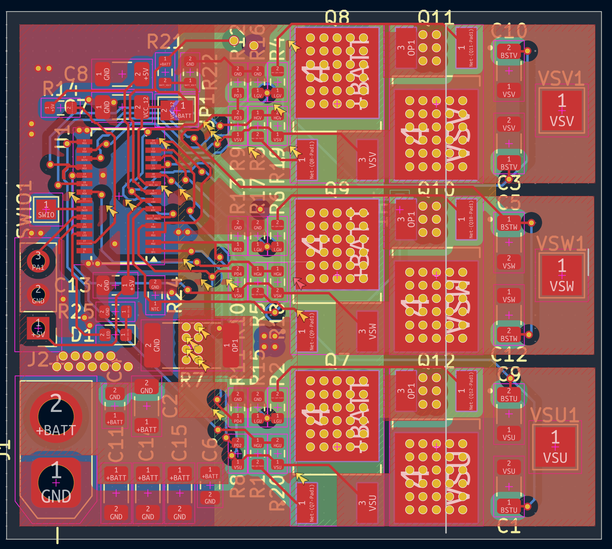
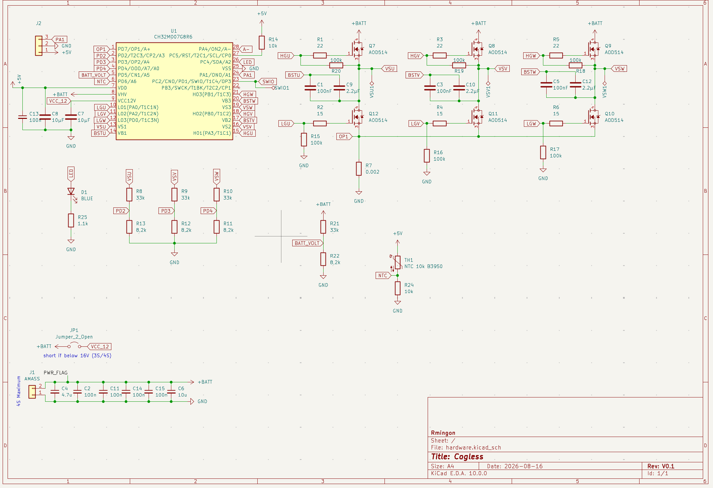

<h1 align="center">Cogless</h1>

  <strong>A single-chip, open-source brushless ESC built around the WCH CH32M007.</strong> 
  One RISC-V motor-control SoC, six MOSFETs, a handful of passives. Every design file public.

  
  
  
  
  
  
  

  

---

## Overview

Most hobby ESCs are black boxes: closed firmware, undocumented hardware, and a microcontroller, gate driver and op-amps spread over a dozen chips. Cogless takes the opposite approach.

The **WCH CH32M007G8R6** integrates on a single die everything the brain of an ESC needs: a RISC-V core, a three-phase 48 V N+N gate pre-driver with bootstrap diodes, the high-voltage and logic regulators, a programmable-gain current amplifier, comparators wired to the PWM timer's emergency brake, and a 3 Msps ADC. The result is a complete motor controller with **one IC, six MOSFETs and a few passives** on a 45 × 40 mm board.

| | |
|---|---|
| **Control** | Sensorless six-step (trapezoidal) commutation, back-EMF sensing |
| **Start-up** | Automatic motor detection and tuning, stored in flash |
| **Protection** | Hardware over-current break, cycle-by-cycle current limit, voltage and thermal derating |
| **Openness** | KiCad sources, fabrication outputs and firmware, dual-licensed |

## Hardware

### Specifications

| Parameter | Value |
|---|---|
| Controller | WCH CH32M007G8R6, QingKe RISC-V, 48 MHz, 62 KB flash, 8 KB RAM, SSOP-28 |
| Gate driver | Integrated three-phase N+N pre-driver, bootstrap diodes, up to 48 V |
| Power stage | 6 × AOD514 (30 V, 46 A, 5.9 mΩ), DPAK, thermal via arrays |
| Supply | 2S to 4S LiPo (6 V to 16.8 V), XT30 connector |
| Regulation | Internal high-voltage LDO and 5 V logic LDO, no external regulator |
| Current sense | 2 mΩ 2512 shunt, Kelvin-routed differential pair, internal PGA (× 16) |
| Voltage sense | Three phase back-EMF dividers and one battery divider, 33 kΩ / 8.2 kΩ (≈ 25 V full scale) |
| Temperature | 10 kΩ B3500 NTC (Cantherm CMFA103J3500HANT) against the low-side MOSFETs |
| Control input | 3-pin header (5 V, GND, signal) |
| Debug | WCH 1-wire SDI (SWIO pad), WCH-LinkE |
| Indicator | Status LED |
| Board | 4 layers, 45 × 40 mm, KiCad 10 |

  

### Design notes

| Topic | Choice |
|---|---|
| **Current sensing** | The shunt is read differentially: both PGA inputs run as a Kelvin pair straight from the shunt pads, so gate-drive noise and power-trace drops stay out of the measurement. |
| **Hardware over-current** | The PGA output feeds an internal comparator wired to the timer's break input: the bridge shuts down without any software involvement. |
| **Gate safety** | All six MOSFETs have 100 kΩ gate pull-downs, the high sides referenced to their own phase node, so the bridge stays off while the driver powers up. |
| **Sensorless and encoder-ready** | The three phase dividers feed the ADC for back-EMF detection. The control header lands on an ADC and timer-capable pin, ready for an AS5600 or MT6701 encoder. |
| **Supply jumper JP1** | Shorts VHV to VCC12V and bypasses the internal high-voltage regulator, which needs more than 18 V. **JP1 must stay closed for every supported pack, 2S to 4S.** It is bridged by default. |

### Schematic

  

The full KiCad project (schematic, routed board) and the fabrication outputs (BOM, placement, netlist, Gerber archive) are in [`hardware/`](hardware/).

## Firmware

The firmware lives in [`firmware_DShot/`](firmware_DShot/) as a MounRiver Studio 2 project, with its own [README](firmware_DShot/README.md) covering the internals, the test modes and the bring-up notes.

### Features

| Feature | Description | Status |
|---|---|---|
| Six-step sensorless control | 48 kHz centre-aligned PWM, 400 ns dead time, closed loop on back-EMF zero crossings | Validated at 24 kHz, 48 kHz bench pending |
| Back-EMF sensing | Floating phase sampled in the PWM off-time, against ground | Validated |
| Current sensing | Single shunt, differential PGA, sampled inside the high-side pulse | Validated |
| Motor auto-tune | Start current, noise floor, open-loop acceleration, hand-off speed, closed-loop acceleration | Validated |
| Start-up and arming tones | The motor itself is used as a speaker | Validated |
| Servo PWM input | 1000 to 2000 µs on the control header | Implemented, bench validation pending |
| Load test | Power stage under a real propeller or vehicle load | In progress |
| DShot input, telemetry | Digital throttle protocol | Planned |
| Field-oriented control | Sinusoidal drive from the same hardware | Planned |

### Protections

| Protection | Behaviour |
|---|---|
| Hardware over-current | Comparator to timer break, outputs off immediately |
| Software over-current | Fault after three consecutive samples above the limit |
| Current limiting | Cycle-by-cycle peak limit and slow fold-back |
| Speed ceiling | Duty backed off at the highest speed the sampling can follow |
| Under-voltage | Cell count detected at arming, fold-back then cut-off per cell |
| Over-temperature | Board temperature read every 100 ms, derating from 80 °C, cut-off at 100 °C |
| Loss of signal | Throttle failsafe after 100 ms without a valid pulse |
| Desynchronisation and stall | Outputs off, automatic restart at zero throttle |
| Watchdog | Independent watchdog, 100 ms |

### Current limitations

| Limitation | Detail |
|---|---|
| Speed ceiling | About 80 000 eRPM at 48 kHz (≈ 11 400 rpm on a 14-pole motor), duty limited to about 83 % |
| Load validation | Full-power behaviour under a propeller is still being characterised |

## Getting started

| Step | Action |
|---|---|
| 1 | Order the board from the files in [`hardware/production/`](hardware/production/), or build it from the KiCad sources. |
| 2 | Check that **JP1 is closed**. |
| 3 | Open [`firmware_DShot/`](firmware_DShot/) in MounRiver Studio 2, build, and flash through a WCH-LinkE on SWIO, GND and 5 V. |
| 4 | First power-up on a current-limited supply, motor fixed, **no propeller**. The ESC beeps, then tunes itself to the motor. |
| 5 | Set the throttle source and limits in [`motor_config.h`](firmware_DShot/User/motor_config.h). |

## Repository layout

| Path | Content |
|---|---|
| [`hardware/`](hardware/) | KiCad 10 project: schematic, PCB |
| [`hardware/production/`](hardware/production/) | Fabrication outputs: BOM, placement, netlist, Gerber archive |
| [`firmware_DShot/`](firmware_DShot/) | Firmware, MounRiver Studio 2 project |
| [`firmware_DShot/User/`](firmware_DShot/User/) | Cogless firmware sources |
| [`LICENSE-HARDWARE`](LICENSE-HARDWARE) | CERN-OHL-S v2 |
| [`LICENSE-FIRMWARE`](LICENSE-FIRMWARE) | GPL-3.0 |
| [`LICENSE-COMMERCIAL.md`](LICENSE-COMMERCIAL.md) | Commercial licensing |

The CH32M007 datasheet and reference manual are available from [WCH](https://www.wch-ic.com/products/CH32M007.html).

## Safety

> **Warning.** This is a power-electronics project. LiPo batteries and spinning motors can cause fire and serious injury. Always start on a current-limited supply, keep propellers off during bring-up and auto-tune, and never leave a first power-up unattended. You build and use this design at your own risk.

## Contributing

Issues and pull requests are welcome: layout review, firmware improvements, bring-up reports, or photos of your build. If you spin a variant (higher-voltage MOSFETs, other connectors), open a discussion first: the goal is a family of small, hackable ESCs.

Because Cogless is dual-licensed, a contribution can only be merged if you agree that it may also be distributed under the commercial licence. You keep the copyright of your contribution.

## License

Cogless is **dual-licensed**: open source under strong copyleft licences, or under a commercial licence.

| Part | Open-source licence |
|---|---|
| **Hardware**: everything under [`hardware/`](hardware/) | [CERN-OHL-S v2](LICENSE-HARDWARE) |
| **Firmware**: the files written for Cogless, marked with the Cogless SPDX header | [GPL-3.0-only](LICENSE-FIRMWARE) |

| You want to | Licence |
|---|---|
| Use, study, modify, build or sell Cogless, and publish your modified design files and firmware under the same licences | Open source, free of charge |
| Ship a product based on Cogless without publishing your changes, or combine the firmware with proprietary code | [Commercial licence](LICENSE-COMMERCIAL.md) |

**Third-party files.** The WCH SDK files in `firmware_DShot/Core/`, `Peripheral/`, `Startup/`, `Debug/`, and the `system_ch32v00X.*`, `ch32v00X_it.*` and `ch32v00X_conf.h` files in `User/`, are copyright Nanjing Qinheng Microelectronics (WCH) and remain under WCH's own terms. They are not covered by the Cogless licences.

Copyright © 2026 Ronan Mingon

